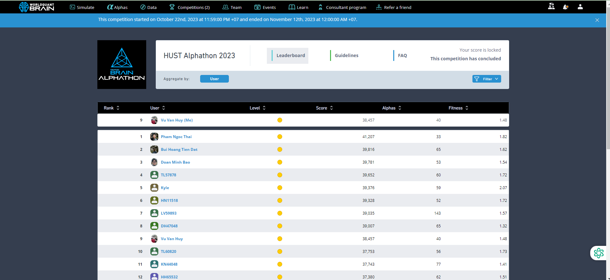
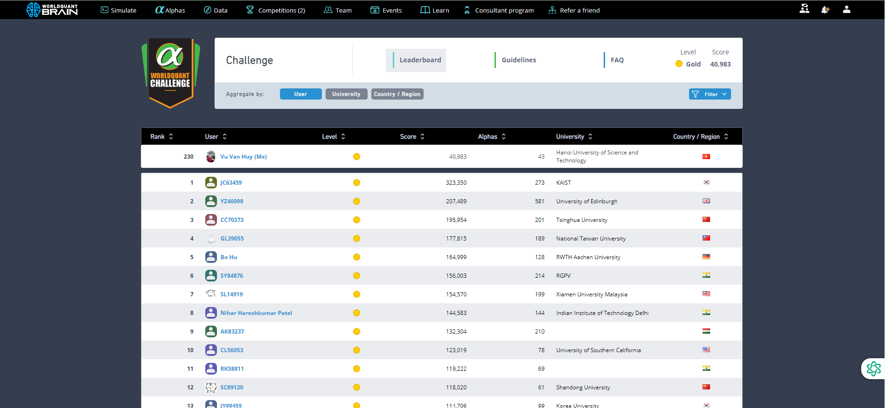

# link: https://platform.worldquantbrain.com/learn

# Tổng hợp alpha đã submit mùa giải Alphathon Hust Challenge 2023

Các alpha đa phần là đi copy trên github này để về sửa

Khi tham gia cuộc thi các bạn chú ý thời gian, lúc mình thi thời gian là 12h+7AM nghĩa là bắt đầu từ lúc 12h đêm, phải cực kỳ chú ý thời gian kết thúc cuộc thi (chỗ mình kết thúc lúc 7h sáng). Mình không chú ý nên là đi toi ngày cuối rớt từ top 3 xuống top 9(may vẫn ontop dmmm). Cả ông top 1 cũng bị xuống luôn top 5 luôn. 

Cũng tức vì mất toi 600$ (tính cả chi phí cơ hội nhưng đây cũng là một bài học xương máu đối với bản thân). Mọi sai lầm đều phải trả giá bằng tiền. 

Đây nhé không lại bảo điêu :)

# Giải thưởng lần lượt là:

## top 1: 1000 $
## top 2: 700 $
## top 3: 400 $
## top 4-5: 200 $
## top 6-10: 100 $ 

(Tổng 3000$)

Điểm số cập nhập lúc 1h30 hằng ngày(có thể xem luôn tại lúc 1h25 ở chỗ rank thế giới)

# Các tips:

- Cứ ngồi sửa alpha đến chết, mình simulate 3000 lần mà về cuối toàn đi copy, ngày cuối chuẩn bị dư 5 con alpha rồi vẫn miss top cay diu chiu đc >....

- Cực kỳ chú ý thời gian(outop vì lý do này nên nhớ đời lắm hêhe)

- Viết alpha không khó, chỉ lâu thôi, lâu vcut, chsu ý gán màu tùy theo độ good của alpha

- Lời khuyên là nên vào chỗ data, tìm cái data nào ít người làm(hiển thị số user và alpha ở trường dữ liệu đấy dưới 1). 

- Nên tập chung đối với thị trường CHN vì con alpha nào submit được đề fitness cao cả.(Hồi trước mình tạo được con alpha có fitness = 8 )

- Các tính điểm thì chủ yếu là cứ finess cao, universe cao(nên top 3k), Điểm trùng lặp(cái roboot gì đấy) thấp thì ngày chỉ cần 2 con alpha là full điểm không cần phải 3 còn như mấy ông hướng dẫn bảo.

- Cứ simulate nhiều vào không lo. Thỉnh thoảng nó báo lỗi là do máy chủ, chờ nửa ngày là được. À cả cái này, gặp phải đúng lúc ko có alpha để submit thì đúng đen(nên tích trữ 2 , 3 con alpha vào)

Nên để decay là 4, 10, 11, truncation là 0.01, 0.08, 0.1 có thực nghiệm rồi nên yên tâm là để như này dễ có alpha

$\Rightarrow$ Ai học suy luận thống kê với machine learning rồi thì viết alpha mới mượt lắm hiểu các đại lượng covaria, entropy, diff, avg, max, min là ngon ngay.

# Trong suốt cuộc thi phải submit alpha liên tục các ngày nếu không sẽ bị outop ngay lập tức

- Chỉ nên hi vọng kiếm giải cấp university, cấp world khó lắm

- Ngay khi bắt đầu nên submit những alpha có sẵn ở trong phần hướng dẫn, đối với các alpha tự nghĩ không nên chồng nhiều trong inalph(do có thể ngày hôm sau alpha đó bị trùng với người khác - 1 cơ chế chống lặp lại alpha của worldquant) 

- Cách mình tham gia là cứ lên google search công thức tài chính(đã thử và được kha khá alpha) nếu bạn không thuộc khối tài chính

- Hoặc lên các diễn đàn, github(có cả tài liệu làm alpha) tìm alpha mẫu do cơ chế cuộc thi nên hình như ban đầu tất cả alpha đều được làm mới(nghĩa là kể cả alpha đã submit rồi cx thành chưa)

- Quan trọng nhất vẫn là ngày nào cũng phải submit alpha đừng nghĩ các top sẽ bị rớt ngày nào nhé! Trước mình cũng nghĩ thế

- Đối với trường hợp các alpha mẫu ko submit được hoặc là các chỉ số quá thấp, nên thay đổi thử universe...

Cuối cùng:  Xin chúc mọi người tham gia các mùa giải về sau thật tốt, có giải đừng quên mình nhé :)

# Good luck 